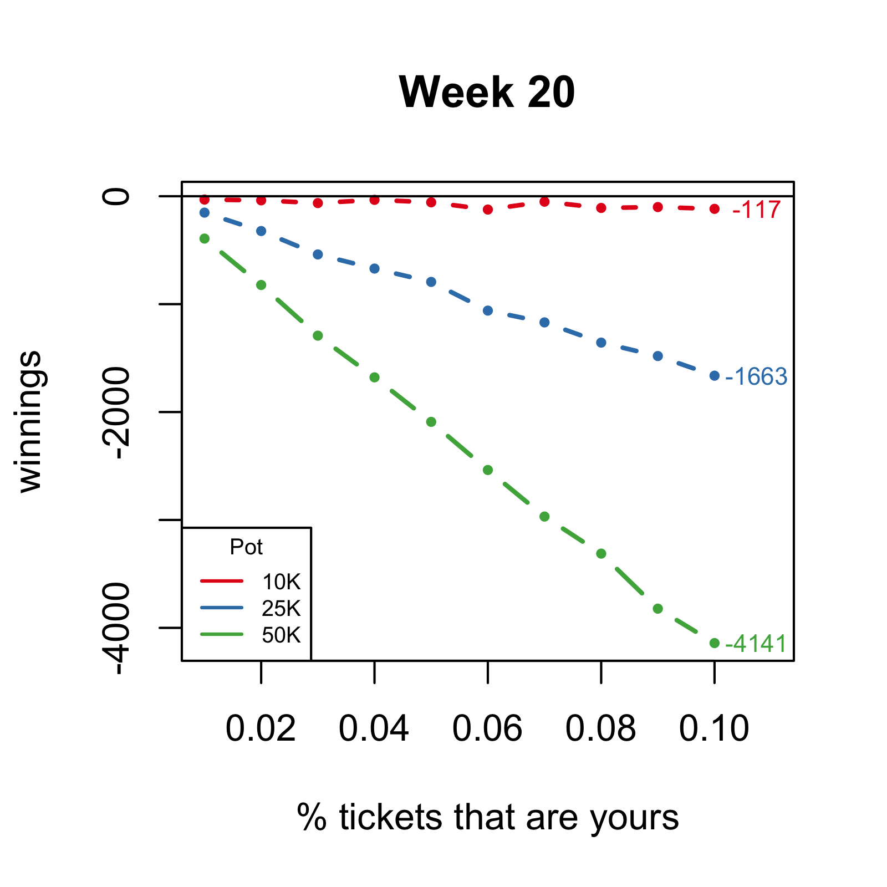
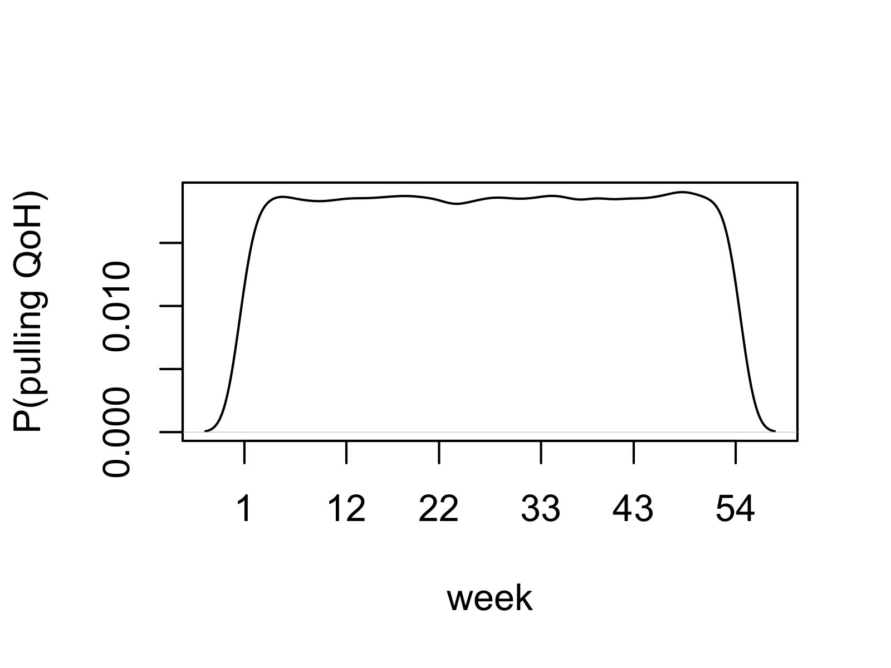

## Multi-condition simulation results
Simulation results are displayed below. They show that the expected earning from playing QoH is negative in all scenarios.


The code simply simulates the drawing for a single week. My experience says that the week value does not matter. You must not set the total pot size to be less than the total amount which could be paid out in a single drawing, which is $10K. This is because the game would never start unless $10K was funded.

In all simulation replicates, I assumed the jokers and queen of hearts was not drawn before the week in which the simulation was performed.

See the [QoH_simres.R code](QoH_sim.R) for exactly how to run the simulation. Just run the entire file and it will save the plot, for example with
```
Rscript QoH_simres.R
```
from the command line. The plot will be saved in your current working directory.

The code to make a single drawing at a a given week with the `unturned_deck` set of cards left unturned is:
```R
draw=function(all_tickets,my_tickets,unturned_deck,pot) {
  # winnings for a single draw (not considering multiple weeks)
  prob_me=my_tickets/all_tickets
  tickets=sample(c(
    rep(FALSE,all_tickets-my_tickets),
    rep(TRUE,my_tickets)),
    5,
    replace=FALSE)
  # calculate all possible returns at once
  case_winnings=c(special_case(unturned_deck,pot)$winning,2000,1500,1000,500)
  # winnings
  return(tickets*case_winnings)
}
```
This code allows players to win multiple times on a single draw, which is not defined as prohibited in the rules.

## Real-world simulation result
I also performed a simulation under the conditions of the current state of QoH (see [here](https://queenofheartsgame.com/)). These results can be produced by simply running:
```R
source('QoH_sim.R')
simulation(week=15,
           my_tickets=10000, # 10000/1754323 -> 5.8% chance of winning
           all_tickets=1754323, # current pot
           niter=10000
           )
```
which prints `-9945.45` to the console. This result indicates you are expected to lose ~$10K (all of your bet) if you play this week. The simulation results above suggest you have a better chance of winning money when the pot is smaller, which is very likely to occur at earlier weeks.

Consider if the current pot is won this week by a QoH and next week (or the next bi-week, whenever they do it) has the new pot of `1754323*0.1`, or `175432.3`. What is the expected return if you play then. Keeping the same proportion of tickets as before?
```R
new_pot=round(1754323*0.1)
simulation(week=15,
           my_tickets=round(new_pot*10000/1754323), # keeps the same 5.8% chance of winning
           all_tickets=new_pot, # current pot
           niter=10000
           )
```
which prints `-954.6` and indicates you are expected to lose $954 (all of your bet).


### Buying every ticket
An important fact to remember is that even if you owned all of the tickets your expected winnings is still negative because 10\% of every pot gets rolled over.

You can simulate this condition by running:
```R
simulation(week=1,
           my_tickets=10000,
           all_tickets=10000,
           niter=1000
           )
```
which shows expected return of `-1784`. This is almost exactly the theoretical value, which I won't prove.

### Predicting QoH's most likely week
You can't: 

This simulation is really simple:
```R
niter=100000
week=c()
for(i in 1:niter) {
  deck=newdeck()
  cards=sample(deck,54,replace=FALSE)
  week[i]=which(cards=='QH')  
}
```
The QoH is unlikely early and late (unless it hasn't been pulled yet). It is mostly likely to be pulled between weeks ~3 and 51.
